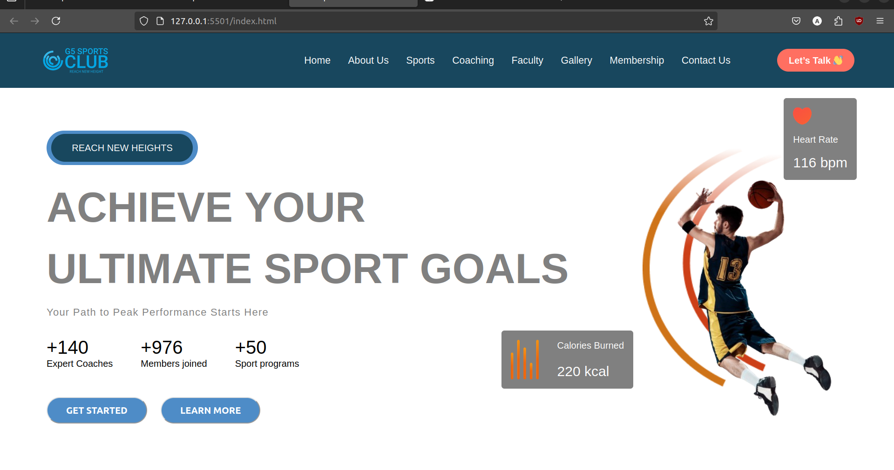

# G5 Sports Club Website

This repository contains the code for the G5 Sports Club website. The website includes various sections such as Home, About Us, Sports, Coaching, Membership, Gallery, Faculty, and Contact Us.

## Table of Contents

- [Introduction](#introduction)
- [Features](#features)
- [Pages](#pages)
- [Installation](#installation)
- [Usage](#usage)
- [Project Structure](#project-structure)
- [Technologies Used](#technologies-used)
- [Contributing](#contributing)
- [License](#license)
- [Acknowledgements](#acknowledgements)

## Introduction

This project aims to create an engaging and user-friendly website for a sports club. It provides all necessary information for current and prospective members, coaches, and visitors.

## Features

- **Responsive Design**: The website is fully responsive, ensuring a great user experience on all devices, from desktops to smartphones.
- **Interactive Elements**: Engaging elements like a heart rate monitor and calories burned indicator to motivate users.
- **Informative Content**: Detailed information about the club, its sports programs, and coaching faculty.
- **Photo Gallery**: Showcases images of club events, facilities, and members in action.
- **Membership Details**: Provides information on how to join the club and the benefits of membership.
- **Coaching Expertise**: Information on expert coaches available to guide members.
- **Contact Form**: Allows visitors to get in touch with the club administration easily.
- **Event Information**: Keeps members updated about upcoming events and activities.

## Pages

### Home


(./images/hom.png)
The landing page provides an overview of the club and quick links to other sections.
### About Us

Contains information about the club's mission, vision, and the benefits of joining.

### Sports

Details the various sports programs available at the club.

### Coaching

Information on expert coaches, their qualifications, and coaching philosophy.

### Membership

Provides detailed information about membership options, benefits, and how to join.

### Gallery

Displays a collection of photos showcasing club events, facilities, and members in action.

### Faculty

Information about the coaching and administrative staff at the club.

### Contact Us

Includes contact details, a map of the club’s location, and a contact form for inquiries.

## Installation

To run this project locally, follow these steps:

1. Clone the repository:
   ```bash
   git clone https://github.com/Abhishekkatale/G5-Sports-Club.git
   ```

2. Open the `index.html` file in your web browser:
   ```bash
   open index.html
   ```

## Usage

Once the website is open in your browser, you can navigate through the different pages using the menu at the top. Explore the club’s offerings, view the gallery, and learn more about the coaching staff and membership options.

## Project Structure

```plaintext
G5-Sports-Club/
│
├── index.html          # The main landing page
├── about.html          # About Us page
├── sports.html         # Sports programs page
├── coaching.html       # Coaching staff page
├── membership.html     # Membership information page
├── gallery.html        # Photo gallery
├── faculty.html        # Faculty and staff information
├── contact.html        # Contact Us page
└── assets/             # Folder containing images, styles, scripts
    ├── css/            # Stylesheets
    ├── images/         # Image assets
```

## Technologies Used

- **Frontend**: HTML, CSS
- **Other Tools**: Git for version control

## Contributing

Contributions are welcome! Please follow these steps:

1. Fork the repository.
2. Create a new branch (`git checkout -b feature-branch`).
3. Make your changes.
4. Commit your changes (`git commit -m 'Add some feature'`).
5. Push to the branch (`git push origin feature-branch`).
6. Create a new Pull Request.

## License

Distributed under the MIT License. See `LICENSE.txt` for more information.

## Acknowledgements

Thanks to the G5 Sports Club administration for providing the necessary information and resources. Special thanks to all contributors for their hard work and dedication.

